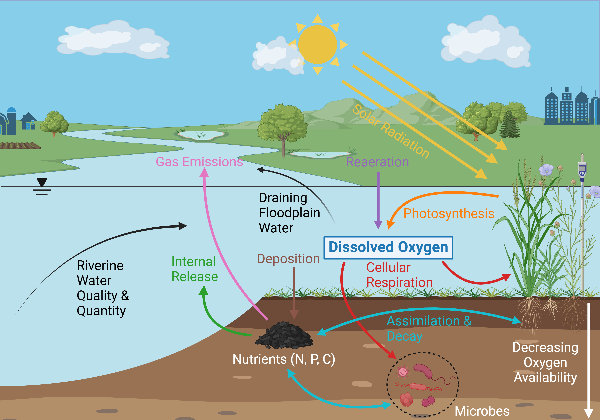

# 👋 Hi, I'm Harrison Myers!

**PhD Student | Machine Learning Engineer | Environmental Data Scientist**  
🌎 Passionate about leveraging AI to solve complex, real-world problems in earth systems science and beyond.

---

## About Me

I'm a machine learning engineer and PhD student at the University of Vermont, where I develop predictive models for environmental systems using tools like **graph neural networks**, **computer vision**, and **spatiotemporal deep learning**. I’m especially interested in how AI can improve understanding and management of natural resources, from **river turbidity forecasting** to **agricultural water and nutrient management** to **floodplain oxygen modeling**.

My work combines:
- **Advanced machine learning** (GNNs, LSTMs, CNNs, ViTs)  
- **Geospatial analytics & remote sensing** (Planet imagery, GEE, rasterio)  
- **Data pipeline engineering** (custom ETL workflows, SLURM, shell scripting)
- **Effective communication** (through technical writing, conference presentations, workshops, lectures)
- **Creating beautiful visualizations** (Distilling complex data and concepts into aesthetic, easy to understand figures; see example below)

***Within a context of increased frequency and intensity of flooding, the (a) current “landscape” of flood recovery is decentralized and siloed by jurisdiction leading to costly, repetitive and overlapping cycles of flood damage and repair that are unsustainable.  We envision (b) a future in which communities become more flood resilient when the cycle of repeat flood damages is broken through adoption of transformative approaches to recovery including systems-based assessment, multi-objective optimization and integrated prioritization and delivery of resources.***

***Simplified conceptual model of floodplain DO dynamics as mediated by hydrologically connected riverine water quality and quantity***

---

## Get in Touch

-  [LinkedIn](https://www.linkedin.com/in/harrison-myers-eit-b37156181/)
-  ghmyers96@gmail.com

---

## Stack Highlights

`Python` | `PyTorch` | `TensorFlow` | `Scikit-Learn` | `Google Earth Engine`  
`Docker` | `FastAPI` | `SLURM` | `SQL` | `Git` | `NetworkX` | `GeoPandas`

---
