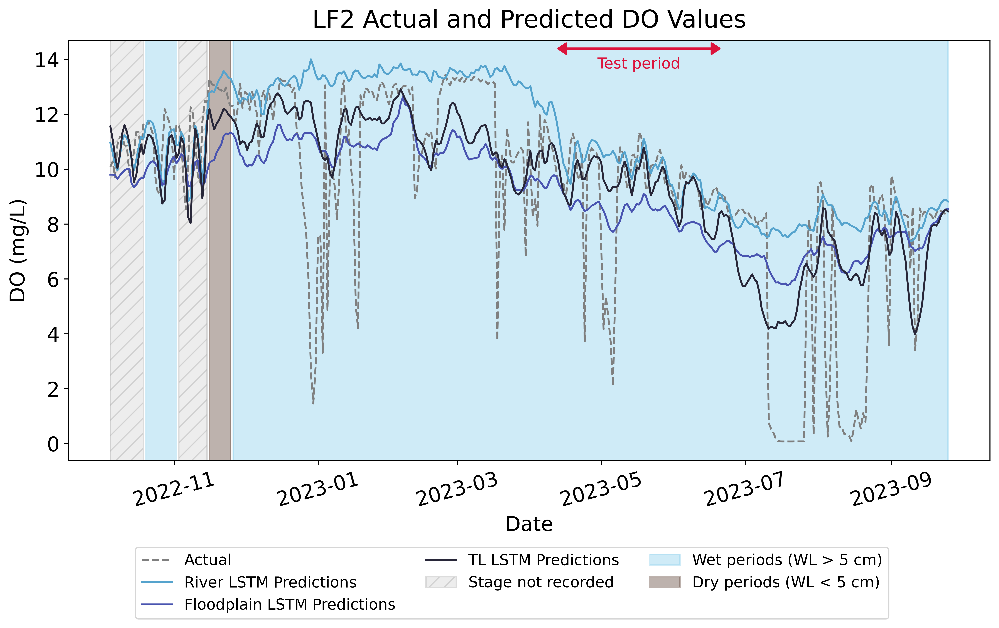
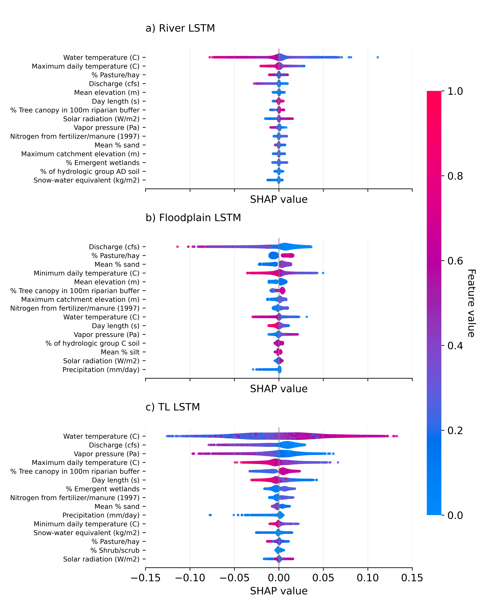
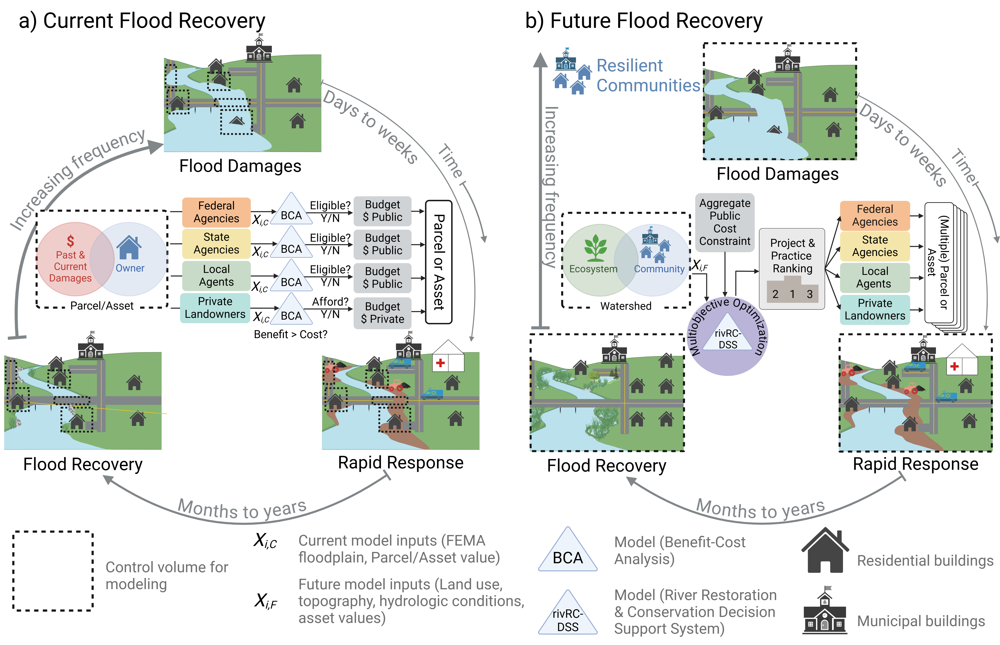

# 👋 Hi, I'm Harrison Myers!

**Data Scientist | Machine Learning Researcher |PhD Candidate**  
🌎 Passionate about leveraging AI to solve complex, real-world problems in water, agriculture, climate, and beyond.

---

## About Me

I'm a data scientist, machine learning engineer, and PhD candidate at the University of Vermont, where I develop predictive models for environmental systems using tools like **graph neural networks**, **computer vision**, and **spatiotemporal deep learning**. I’m especially interested in how AI can improve understanding and management of natural resources, from **river turbidity forecasting** to **agricultural water and nutrient management** to **floodplain oxygen modeling**.

My work combines:
- **Advanced machine learning** (GNNs, LSTMs, CNNs, ViTs)  
- **Geospatial analytics & remote sensing** (Planet imagery, GEE, rasterio)  
- **Data pipeline engineering** (custom ETL workflows, SLURM, shell scripting)
- **Effective communication** (through technical writing, conference presentations, workshops, lectures)
- **Creating beautiful visualizations** (Distilling complex data and concepts into aesthetic, easy to understand figures; see examples below)

***Model predictions of floodplain DO at LF2 for the three models. The observed DO is displayed as the light gray dashed line, vs. the river LSTM model DO predictions (light blue line), the floodplain LSTM model DO predictions (dark blue line), and the TL LSTM model DO predictions (dark gray line). Wet periods (i.e., water level on the floodplain was greater than or equal to five centimeters) are shaded light blue, and dry periods (i.e., water level on the floodplain was less than five centimeters) are shaded brown for context. Periods where stage data were not recorded or were erroneous are shaded with a light gray hatched pattern. The random testing period is delineated by the red arrow at the top of the figure. LSTM model predictions rely on scaled discharge from a nearby USGS gage rather than floodplain water stage as an input.***

***Beeswarm plot of feature attributions across three models: a) river LSTM model, b) floodplain LSTM model, c) TL LSTM model. The vertical grey line represents the expected value of the model predictions, any values to the left of the grey line represent lower than average predictions, and vice versa for positive values. The color bar represents a gradient of low to high feature values for each input feature. Features are ranked by the magnitude of their mean SHAP value from top to bottom.***

***Theoretical source tracing of turbidity or other parameters of concern enabled through a Graph Neural Network modeling approach coupled with a spatial directed graph.***

***Within a context of increased frequency and intensity of flooding, the (a) current “landscape” of flood recovery is decentralized and siloed by jurisdiction leading to costly, repetitive and overlapping cycles of flood damage and repair that are unsustainable.  We envision (b) a future in which communities become more flood resilient when the cycle of repeat flood damages is broken through adoption of transformative approaches to recovery including systems-based assessment, multi-objective optimization and integrated prioritization and delivery of resources.***

---

## Get in Touch

-  [LinkedIn](https://www.linkedin.com/in/harrison-myers-eit-b37156181/)
-  ghmyers96@gmail.com

---

## Stack Highlights

`Python` | `PyTorch` | `TensorFlow` | `Scikit-Learn` | `Google Earth Engine`  
`Docker` | `FastAPI` | `SLURM` | `SQL` | `Git` | `NetworkX` | `GeoPandas`

---
