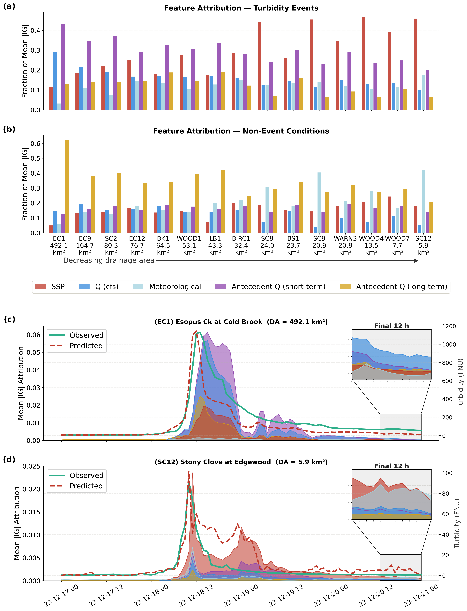
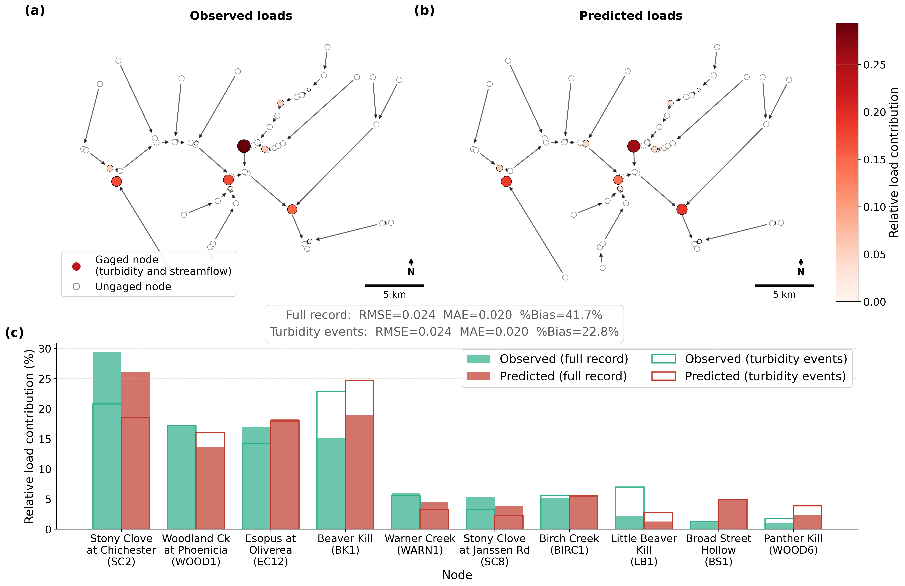

# Harrison Myers

### ML Scientist - Spatiotemporal Deep Learning for Networked Systems | PhD Candidate, University of Vermont

---

## About Me

I build machine learning systems for structured, spatiotemporal data, applying GNNS, CNNs, LSTMs, and traditional ML to sensor networks and remote sensing to model how signals and risk propagate across physically constrained systems with sparse and highly dynamic data.

My PhD research focuses on spatiotemporal deep learning for water quality and quantity prediction across river networks. I'm increasingly interested in applying these modeling approaches beyond hydrology, to any domain organized around interconnected, physically or structurally constrained systems.

---

Check out some examples of my work below!
### Transfer learning improves predictions of floodplain dissolved oxygen

### IG feature attributions recover drainage-area dependent process-controls on sediment transport dynamics

### GNN excels at predicting sources of turbidity within a river network

### Conceptual diagram of current and future flood recovery

---

## Get in Touch

-  [LinkedIn](https://www.linkedin.com/in/harrison-myers-eit-b37156181/)
-  ghmyers96@gmail.com

---

## Stack Highlights

`Python` | `PyTorch` | `TensorFlow` | `Scikit-Learn` | `NetworkX`
`Google Earth Engine` | `SLURM` | `SQL` | `Git` | `GeoPandas`

---
